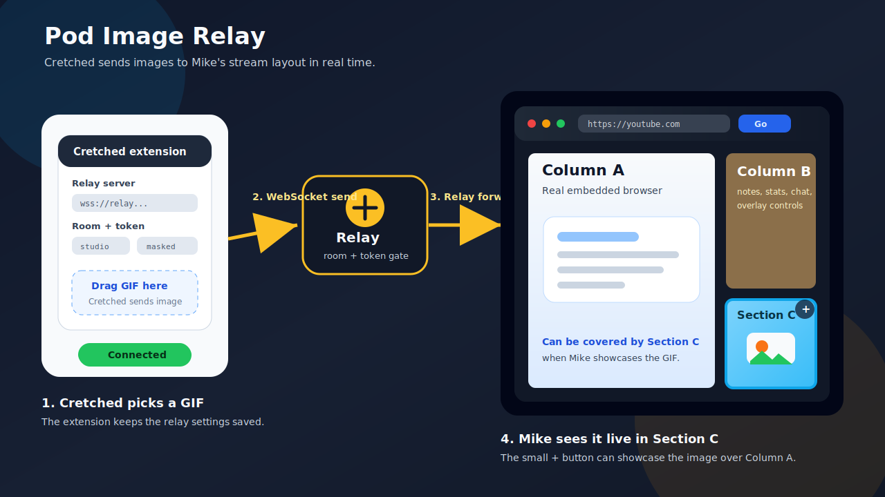

# pod-image-relay

Display images and GIFs on stream from a trusted remote sender.

This project lets Mike run a Windows desktop "Podcast Device" app while
Cretched pushes GIFs or images into Mike's stream layout from a browser
extension.

## Result

When everything is running:

- Mike opens the Podcast Device app on Windows 11.
- Web Browser is a real embedded browser for websites such as YouTube, X/Twitter, docs, show notes, or search.
- Streamlabs / Webcams / Overlay / Chat is Mike's stream-side utility area.
- Images / Animated GIFs is the media area that Cretched can update remotely.
- Cretched drags an image or GIF into his extension popup.
- The relay forwards it to Mike's app, and Images / Animated GIFs updates live on stream.



## Project Pieces

- `podcast-device-app/` is Mike's Electron app.
- `relay-server/` is the WebSocket relay that sits between Mike and Cretched.
- `cretched-extension/` is Cretched's Chrome/Edge extension.
- `DEPLOYMENT.md` has the longer Railway and Digital Ocean deployment notes.
- `BUILD_PLAN.md` has the original architecture and implementation plan.

## Requirements

- Windows 11 for Mike's app.
- Node.js 20 or newer.
- npm.
- Chrome or Edge for Cretched's extension.
- A shared relay server URL, room code, and token.

For local testing, the relay URL is usually `ws://localhost:8080`.
For real use over the internet, the relay URL should be `wss://...`.

## Mike Setup

Mike runs the desktop app.

1. Install app dependencies:

```powershell
cd podcast-device-app
npm install
```

2. Start the app:

```powershell
npm start
```

3. In the app, open the relay controls if they are hidden.

4. Enter the relay settings:

- Server: `ws://localhost:8080` for local testing, or `wss://YOUR_RAILWAY_DOMAIN` after deployment.
- Room: the shared room code, for example `mike-cretched-1`.
- Token: the shared token configured on the relay.

5. Click `Connect`.

6. Hide the relay controls before streaming so the server, room, and token are not visible.

The app saves Mike's relay server and room locally. The shared token is encrypted with Electron `safeStorage` when the operating system supports it.

## Mike Usage

- Use the URL bar to browse in Web Browser.
- Use `Ctrl + +`, `Ctrl + -`, and `Ctrl + 0` to zoom the embedded browser.
- Drag the splitters to resize Streamlabs / Webcams / Overlay / Chat and Images / Animated GIFs.
- Click the small `+` button on Images / Animated GIFs to showcase the GIF/image in the Web Browser space.
- Click `-`, the image, or the showcased area to return it to Images / Animated GIFs.
- Use fullscreen for streaming; the app chrome hides until the mouse moves near the top edge.

## Cretched Setup

Cretched uses the browser extension to send images.

1. Open Chrome or Edge.

2. Go to:

```text
chrome://extensions
```

or:

```text
edge://extensions
```

3. Enable `Developer mode`.

4. Click `Load unpacked`.

5. Select the `cretched-extension/` folder from this repo.

6. Pin the extension to the browser toolbar.

7. Open the extension popup and enter the same relay settings Mike is using:

- Server: `ws://localhost:8080` for local testing, or `wss://YOUR_RAILWAY_DOMAIN` after deployment.
- Room: the same shared room code Mike entered.
- Token: the same shared relay token.

8. Click `Connect`.

The extension stores these values in browser storage so Cretched does not need to type them every time.

## Cretched Usage

1. Open the extension popup.

2. Drag a GIF or image into the drop area.

3. The image is sent to the relay.

4. Mike's app receives it and updates Images / Animated GIFs.

Only send images you are comfortable appearing on stream.

## Local Testing

Local testing proves the whole flow before Railway or any public deployment.

### 1. Install Dependencies

Run these once:

```powershell
cd relay-server
npm install

cd ..\podcast-device-app
npm install

cd ..\cretched-extension
npm install
```

### 2. Start the Relay

Open a terminal:

```powershell
cd relay-server
$env:TOKEN="dev-token"
npm start
```

The relay listens at:

```text
ws://localhost:8080
```

### 3. Start Mike's App

Open a second terminal:

```powershell
cd podcast-device-app
npm start
```

Use these relay settings in Mike's app:

- Server: `ws://localhost:8080`
- Room: `mike-cretched-1`
- Token: `dev-token`

Click `Connect`.

### 4. Load Cretched's Extension

In Chrome or Edge, load `cretched-extension/` as an unpacked extension.

Use the same relay settings:

- Server: `ws://localhost:8080`
- Room: `mike-cretched-1`
- Token: `dev-token`

Click `Connect`.

### 5. Send a Test Image

Drag a GIF or image into Cretched's extension popup.

Expected result: the image appears in Mike's Images / Animated GIFs area.

## Deployment

Deploy the relay first. Mike's app and Cretched's extension both connect to
the relay, so nothing works remotely until the relay is reachable over the
internet.

Railway is the recommended first deployment target.

### Railway Summary

Create a Railway service from the `relay-server/` directory.

Set these environment variables in Railway:

```text
HOST=0.0.0.0
TOKEN=CHANGE_ME_TO_A_LONG_RANDOM_STRING
ALLOWED_ORIGINS=null,chrome-extension://YOUR_EXTENSION_ID
MAX_PAYLOAD_BYTES=8388608
MAX_MSGS_PER_MIN=30
MAX_CONNS_PER_IP=5
PING_INTERVAL_MS=30000
```

Do not set `PORT` manually on Railway. Railway provides it.

After Railway deploys, use the public Railway domain as the relay server:

```text
wss://YOUR_RAILWAY_DOMAIN
```

Then update both clients:

- Mike's app: use the Railway `wss://` URL, shared room, and token.
- Cretched's extension: use the same Railway `wss://` URL, shared room, and token.

See [DEPLOYMENT.md](./DEPLOYMENT.md) for the full Railway and Digital Ocean guide.

## Security Notes

- Use `wss://` for real deployment.
- Use a long random production token, not `dev-token`.
- Do not show the relay controls on stream.
- Treat the room as an identifier, not a secret.
- Add Cretched's real extension origin to `ALLOWED_ORIGINS` once the extension ID is stable.
- Rotate the token if it is ever leaked.

## Tests

Run all tests:

```powershell
cd relay-server
npm test

cd ..\podcast-device-app
npm test

cd ..\cretched-extension
npm test
```

GitHub Actions runs the same test suites on push and pull request.

## Limitations

- The Electron app is not packaged into a Windows installer yet.
- Cretched's extension is currently loaded unpacked.
- The relay uses one shared token.
- The browser ad blocker is lightweight and is not a full Brave Shields replacement.
- The relay does not persist the last image after restart.
- There is not yet an admin dashboard for rooms, connected clients, or recent sends.
- Large GIFs can still be heavy for stream bandwidth and browser memory.

## Future Improvements

- Package Mike's Electron app with a signed Windows installer.
- Publish Cretched's extension as an unlisted Chrome Web Store extension.
- Add per-room or per-user tokens.
- Add a small admin page showing connected senders and receivers.
- Add image size warnings before Cretched sends a file.
- Add optional moderation, such as requiring Mike to approve incoming images.
- Add persistent last-image restore after reconnect.
- Add a stronger maintained filter-list based ad blocker.
- Add a one-click Railway deployment template.
- Add app update checks so Mike can keep the app current more easily.
